# Table of Contents

1.  [不规则图形面积计算](#org23e4d44)
    1.  [土壤项目](#org7480881)
    2.  [Polygon Triangulation(多边形三角化)](#org86c2fe2)
        1.  [step](#orgc30b5bf)
        2.  [counter clockwise convex vertex](#orgc87b64b)
        3.  [counter clockwise](#org5999a8b)
    3.  [tools](#org8454b6a)
        1.  [JTS lib](#org96cdd3b)
        2.  [GoeGebra](#orgf28ac73)
    4.  [More](#org27dc5d7)
2.  [Git](#org254d391)

# 不规则图形面积计算

## 土壤项目

## Polygon Triangulation(多边形三角化)

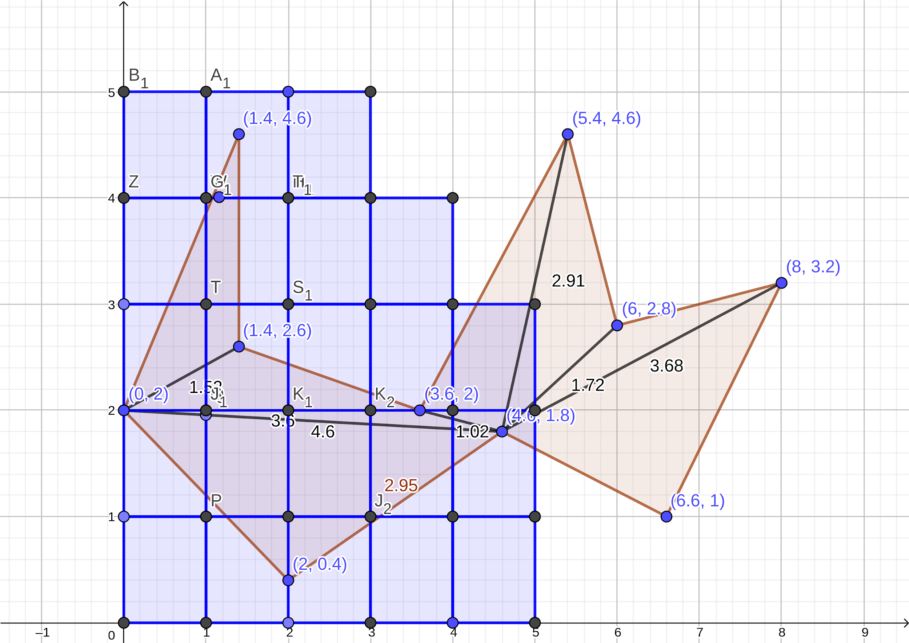

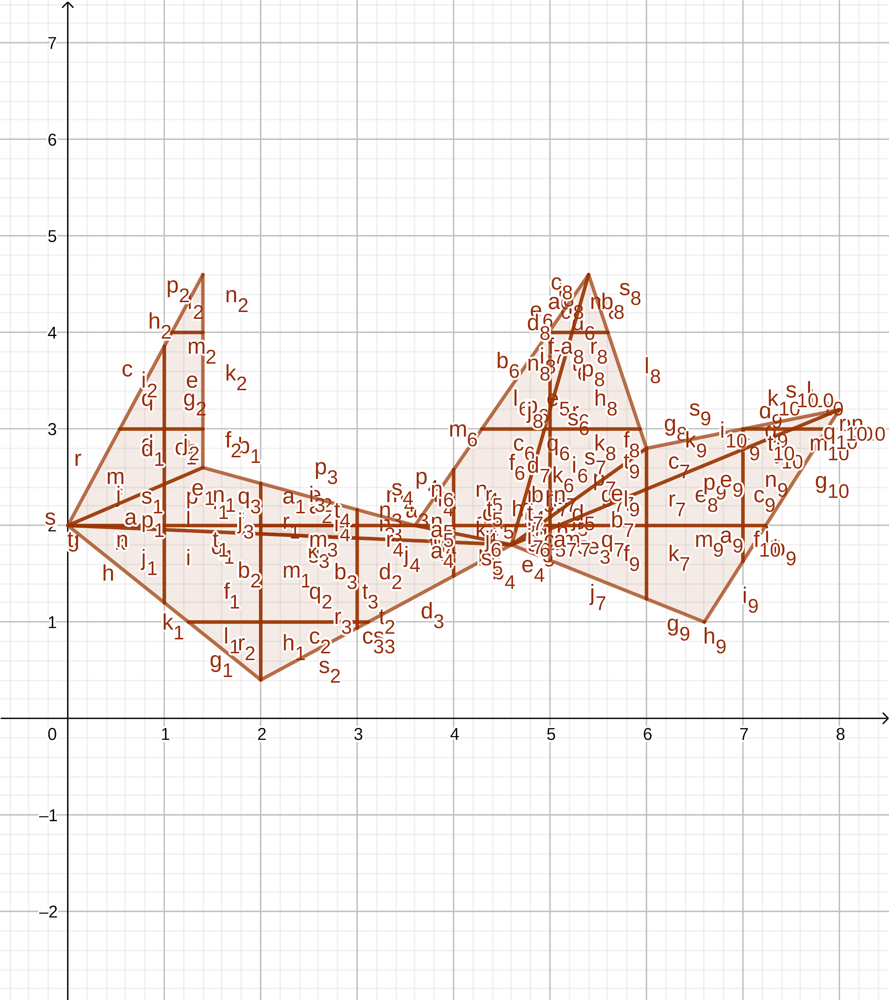

### step

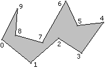
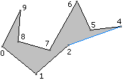
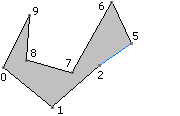

### counter clockwise convex vertex

    def isConvexVertexOnCounterClockWise(start: Vertex, middle: Vertex, end: Vertex): Boolean = {
      (middle.x - start.x) * (end.y - middle.y) - (end.x - middle.x) * (middle.y - start.y) > 0
    }

### counter clockwise

    def counterClockwiseOrder(polygon: Polygon):Polygon = {
      val edgesSum = getEdges(polygon).map{
        case Edge(Vertex(ax,ay), Vertex(bx,by)) =>
          (bx-ax)*(by+ay)
      }.sum
      if (edgesSum > 0)
        polygon.reverse
      else
        polygon
    }

## tools

### JTS lib

<https://github.com/locationtech/jts>

### GoeGebra

<https://www.geogebra.org/>

## More

TriangulationByEarClipping.pdf

# Git

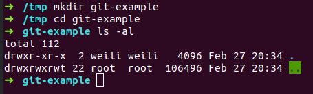

    mkdir git-example
    cd git-example
    git init

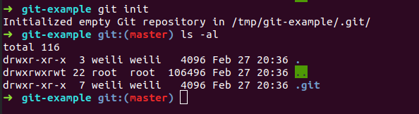

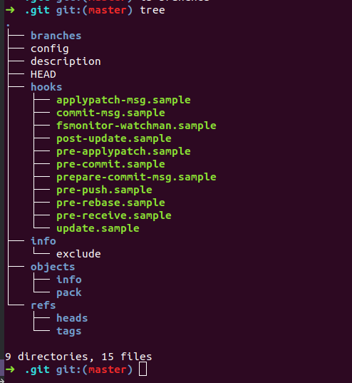

    echo Hello World > some.txt
    git status

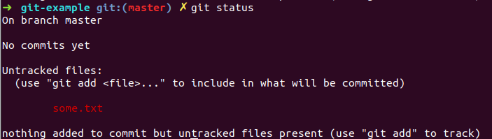

    git add some.txt
    git status
    git cat-file -t 557db03de997c86a4a028e1ebd3a1ceb225be238
    git cat-file -p 557db03de997c86a4a028e1ebd3a1ceb225be238

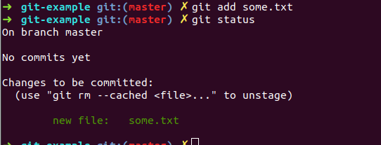

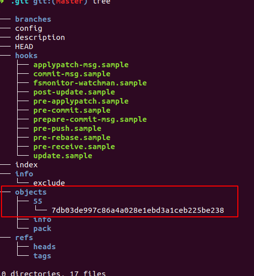

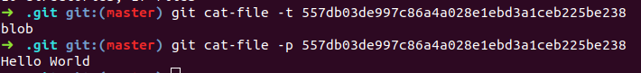

    git commit -m "first commit"
    git status

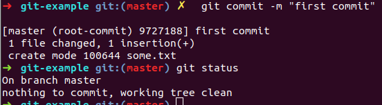

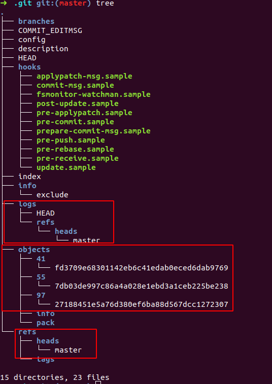

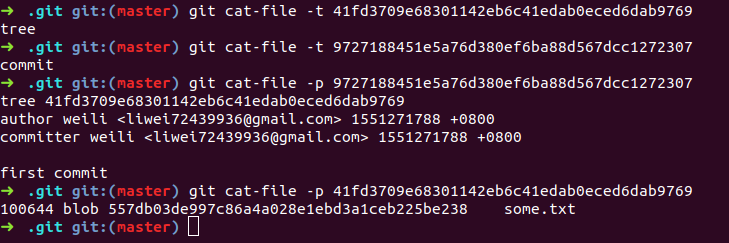

    git checkout -b test-branch

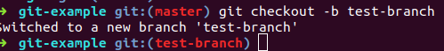

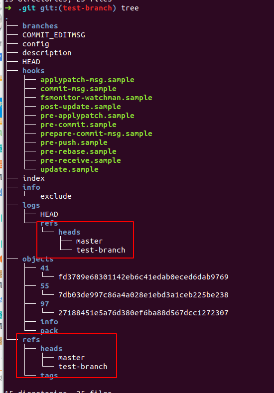

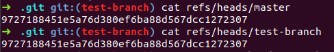

    echo second commit from a >> some.txt
    git add some.txt
    git commit -m "second commit from a"
    git checkout master
    echo second commit from b >> some.txt
    git add some.txt
    git commit -m "second commit from b"
    git branch master-backup

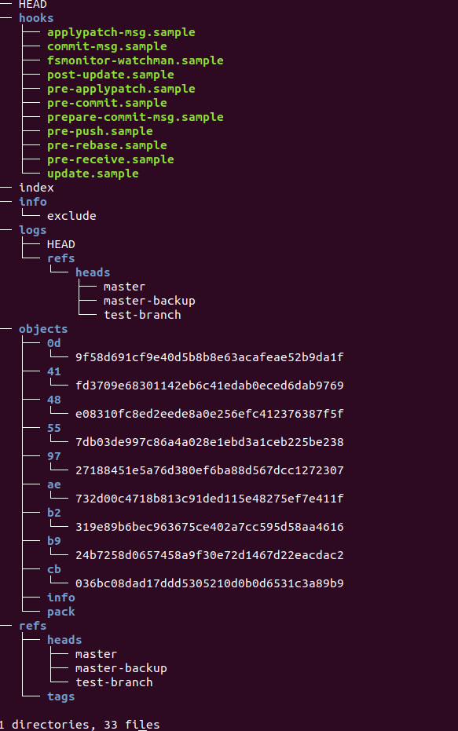

    git merge test-branch
    git add some.txt
    git commit

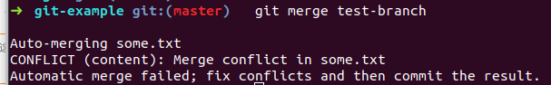

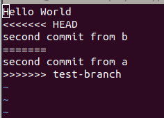

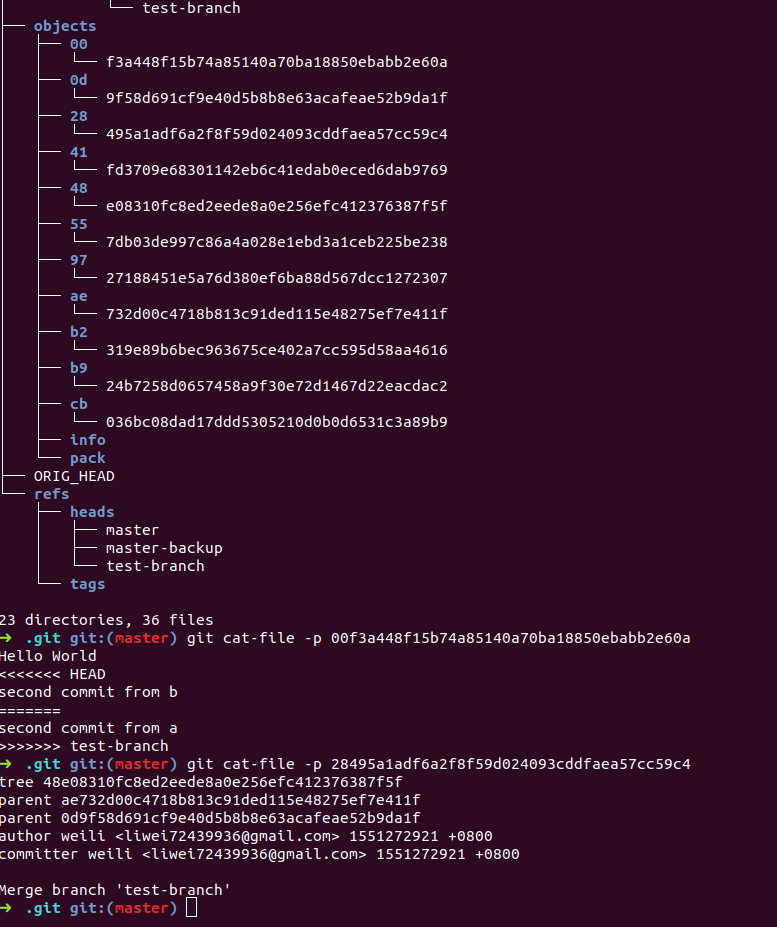

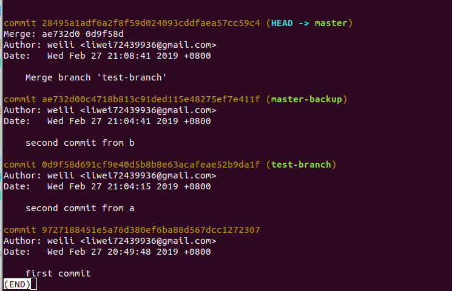

    git checkout master-backup
    git rebase test-branch
    git add some.txt
    git rebase --continue
    git commit

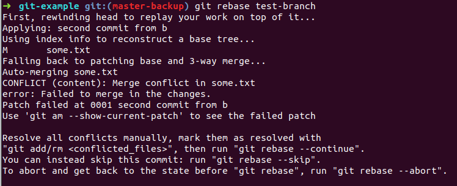

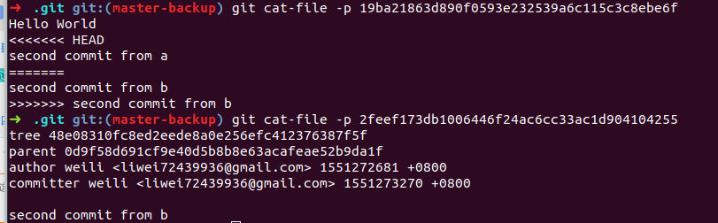

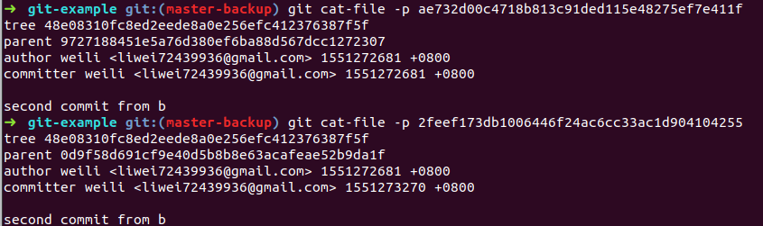

progit.pdf

git pr

